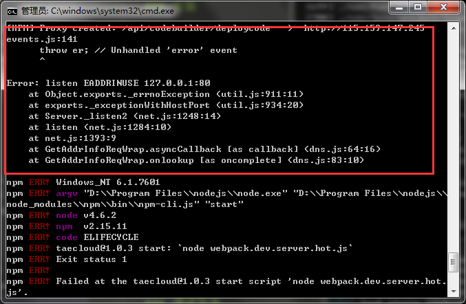

#开发环境

Radmin依赖的环境：

请安装[node](https://nodejs.org)和[npm](https://www.npmjs.com/)

### npm 内网代理设置

开发网需要设置npm proxy才能获取npm源码包，proxy设置方式参见KM文档。
如果实在无法设置，也可以使用tnpm，安装过程参见KM文档

### 安装

Radmin提供了项目创建工具`radmin-tool`来初始化项目

```
$ npm install radmin-tool -g     # 安装项目创建工具

$ radmin-tool demo project-name  # 创建demo类型项目（包含所有demo用法）到名为project-name的文件夹下
                                 # 也可以用radmin-tool project project-name命令创建一个空的project
$ cd project-name
$ npm install                    # 安装项目依赖
$ npm start                      # 启动开发环境webpack服务器（webpack服务器提供热替换功能，如使用其他服务器编译命令为npm run build）
```

访问127.0.0.1出现demo页面说明安装成功，
建议本地host将127.0.0.1配置成qq域名，如project.qq.com，以便于使用qq登录等需要在qq.com域名下才能使用的功能
* 如果在mac等环境开发，需要在命令前加sudo，防止权限错误
* 如果执行npm start命令出现了如下error，说明80端口已经被某个server程序占用，你需要关掉原来的server再执行，或者修改配置使用其他端口
（在webpack.dev.server中将const port = 80改为其他端口号）

 

### 调试发布

```
$ npm start                      # 启动开发环境服务器，代码更改后自动编译热替换，无需刷新
$ npm run build                  # 生成代码（默认压缩），可用于代码部署上线
```

### 目录结构

```
radmin-project
├── package.json                 # package.json
├── src                          # 项目代码
├── web                          # 发布目录
├── webpack.dev.server.js        # 开发环境热加载server
├── webpack.hot.config.js        # 开发环境配置文件
└── webpack.production.config.js # 生产环境配置文件
```

### 升级组件库

Radmin的组件库会持续维护更新。如果你想要升级到最新的组件库，执行下面的命令就可以了

```
$ npm install radmin --save      # 升级radmin组件库
```
