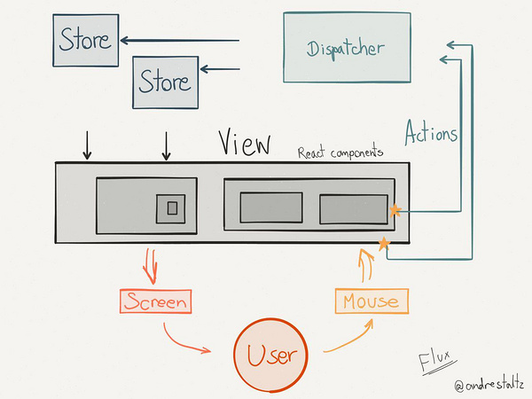

# 基本思想

Radmin框架对Facebook提出的Flux概念进行了实现和扩展，构建了一整套组件和工具集，用一种简单明了的数据流传递方式降低了传统网站后台页面的复杂度

## FLux

> Flux 不是一种框架Lib（Framework）或是一个库（Library），而是一种架构（Architecture）
> Flux使用单向数据流的架构思想，它跟MVC架构是同一类东西，但是更加简单、可预测、可维护

 

* Views ：视图层，监听 Store 变化以获取新的数据，重新 render 自己及子 Component，同时响应用户操作事件
* Action： 动作，由视图层发出的消息，比如mouseclick事件
* Dispatcher： 派发器，用来接收Actions、执行回调函数
* Store：数据层，用来存放应用的状态，一旦发生变动，就提醒Views要更新页面

> 参考文章[《Flux 架构入门教程》](http://www.ruanyifeng.com/blog/2016/01/flux.html) [《图解Flux》](http://zhuanlan.zhihu.com/FrontendMagazine/20263396) 可以了解flux相关的更多内容

## 目录结构

我们来了解一下src目录下的代码结构：

```
src
├── js                 # javascript文件
    ├── actions        # 定义了一系列的操作，将事件注册到dispatcher上
	├── config         # 框架所需的配置文件，比如路由配置，过滤器配置
	├── filters        # 渲染页面之前经过的过滤器，可以进行判断用户权限、记录日志等操作
	├── layout         # 页面布局结构
	├── pages          # 主体显示区域页面片，对应了不同的路由，视图逻辑主要定义在这里
	├── stores         # 数据存储，在store上注册视图中使用的数据模型，一旦有数据变化触发视图重新渲染
	├── index.js       # js的入口文件
├── less               # less样式，兼容css
├── img                # 图片
├── font               # 字体文件
├── mock               # 模拟用的假接口数据
├── vendor             # 第三方js文件
└── index.html         # 单页面html，会自动将入口js嵌入
```
