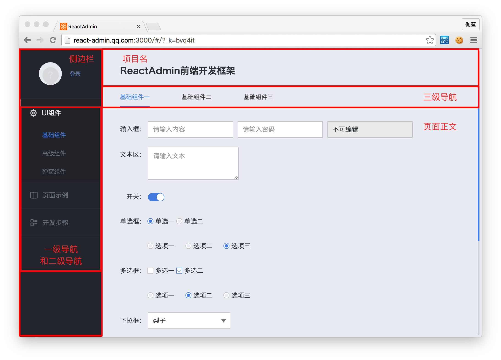

# 页面布局相关功能介绍

Radmin框架本身含有默认的页面布局，代码在layout/default文件夹下。我们在下图可以看到页面由多个部分组成。

 

## 代码示例

在layout/default/App.react.js中，我们在代码中可以清楚的看出页面布局。如需调整布局，比如去掉左边栏，只需要在这段代码里去掉 **&lt;LeftPanel /&gt;** 标签。


```js
var App = React.createClass({
  render: function() {
    return (
      <div className="app">
        <LeftPanel></LeftPanel>
        <RightPanel>
          <RightPanelHeader />
          <RightPanelPage>
            {this.props.children}
          </RightPanelPage>
        </RightPanel>
      </div>
    );
  }
});

```
